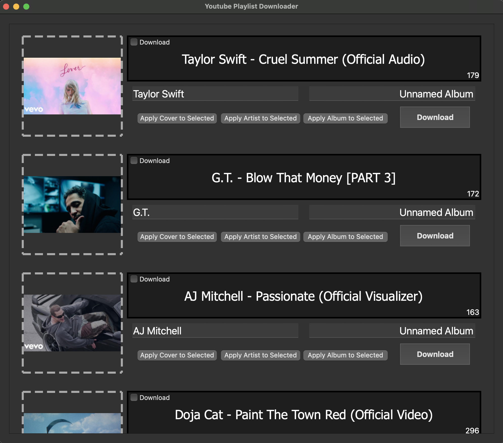

# YT-Music-Downloader
**_Download music and edit metadata all in one program_**

# Music Download and Metadata Editing

YTMD's main feature is it allows metadata editing of downloaded files. Using `PyQt5` for the GUI, and `eyed3` for metadata editing, using `yt-dlp` for the download itself.

# GUI
Drag and drop images from disk into the existing thumbnail to apply your own album art.

## Dependencies and usage
YTMD requires PyQt5, yt-dlp, eyed3, and pytube (explained later).

Running the command `pip install requirements.txt` in the downloaded folder will download these packages.

Run `main.py` using Python 3 to start the program.

Videos download into a Downloads folder in the directory the program is run in.

## `pytube` usage
`pytube` is used to download a list of playlist urls. This is because doing this with `yt-dlp` is extremely slow, due to blocking caused by the design used when it was ported from `youtube-dl`. Videos metadata in a playlist is done one by one, which for large playlist counts, is incredibly slow. `pytube`, however, uses asynchronous methods, resulting in faster load times for certain tasks. Due to the better documentation of `yt-dlp` I decided to keep it in this project, but `pytube` is a very attractive alternative, and **v2** of this project may be rewritten using `pytube`.

# Powered by

   
  

